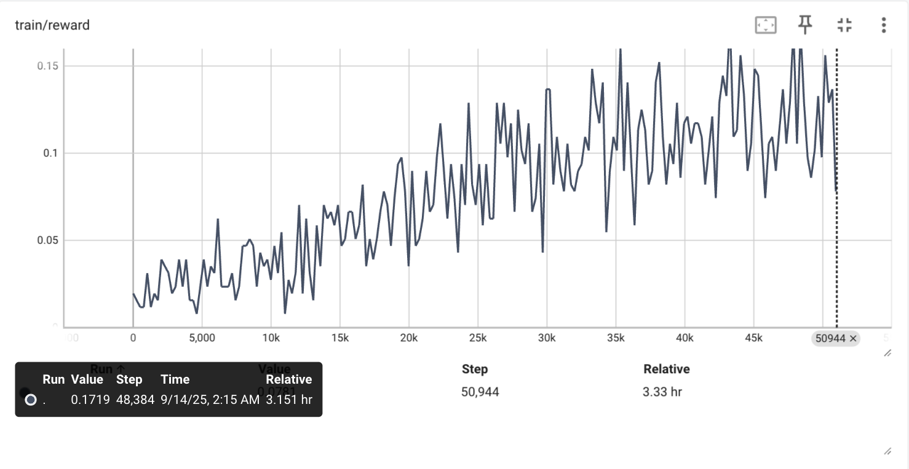
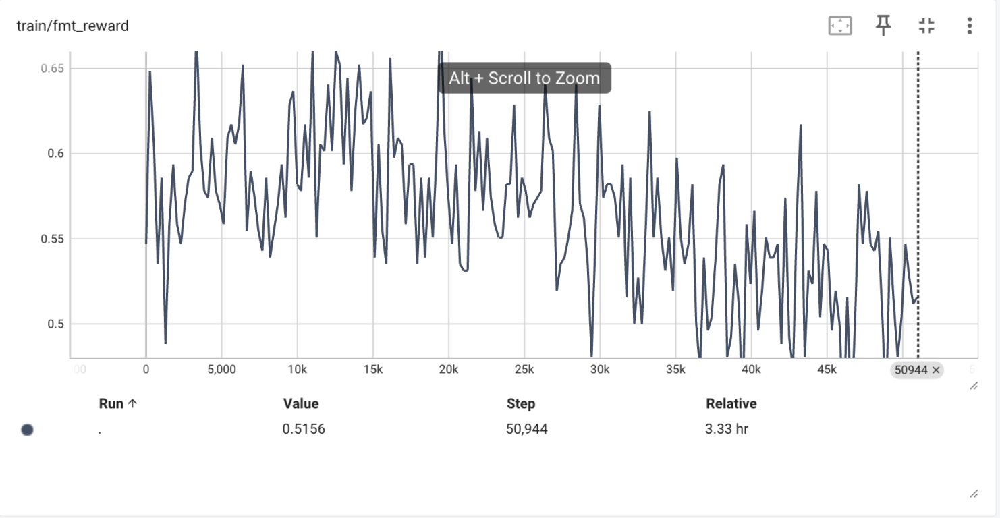

# 说明

本文件为完成cs336_assignment5的相关的实现，每一个一组标题对应一个[官方作业指导说明书](cs336_spring2025_assignment5_alignment.pdf)中的一个需要自己实现的部分。每个部分的要求以及相关指导在指导书中有详细描述。如果涉及到相关代码，在每个一组标题下会单独标注在项目中的代码位置。

## math_baseline P6

代码位置：cs336_alignment/math_baseline.py

(a)测试 Qwen 2.5 Math 1.5B zero-sho在gsm8k test数据集上的性能，从多个角度分析结果

按照官方给出的奖励模型来判断模型的回答和gt是否是同一个答案，但是模型要求严格的format，不然就自成是结果错误，并且对于除了纯数字的输出可以判断为正确，即使答案正确但是包含了其他文字，也会算做不正确。

(b)正确率为1.66%，分析出错的所有情况：
题目一共有1319个，其中format和answer都正确的有22个，format正确但是answer不正确的有252个，format和answer都不正确的有1045个

分析具体的case可以得到以下几个结论：

1. 1.5B模型的指令跟随能力不强，无法正确输出\<think\> \</think\> \<answer\> \</answer\>等格式，在这个部分中，也有一些输出其实是正确的，只是没有遵循要求的格式。
2. 有部分遵循了格式但是结果判断为错误的，其实是正确的，只是说了一句陈述句来表达结果，但是由于结果解析匹配的问题，导致判断为了不正确。
3. 虽然这样的格式要求和正确性判断无法测试出Qwen 2.5 Math 1.5B对于数学问题的真实回答水平，但是可以在后续的sft和rl中看到明显的测评结果提升，从而学习sft和rl的效果特征。

## tokenize_prompt_and_output P9

代码位置：cs336_alignment/utils.py

写一个函数将prompt和output进行tokenize并拼接，核心需要注意以下几个点

- 输入的prompt_strs和outpout_strs都是list，需要单独将每个str都tokenize然后进行统一转换成torch.tensor，padding_token只将输出部分设置为1，prompt和padding都为0，padding需要的长度由一个batch内最长的一个数据决定
- **重要**：需要注意的是需要对input_ids和labels进行截断，一个删除最后一个token，一个删除第一个，但是需要在加入padding token之后再进行截断，而不是先截断再加padding token

## compute_entropy P10
代码位置：cs336_alignment/utils.py

计算一个token output logits的分布信息熵，信息熵越小，说明模型对下一个token的预测越确定，信息熵越大，说明越不确定。token entropy的范围是0到log|X|，|X|是词表大小

计算方法如下：
$$
H(p) = -\sum_{x\in V}p(x)logp(x)
$$
其中在计算概率的时候会用到softmax来计算，因为大模型的输出只是logits并不是概率。而为了防止数值不稳定，需要使用logsumexp的技巧，也就是先减去一个最小值再计算softmax，而在torch中有一些相关的函数，比如

```python
torch.nn.functional.log_softmax()# 稳定计算一堆数据的softmax之后求对数
torch.logsumexp()# 稳定计算一堆数据的对数指数和
```

其中就可以使用log_softmax来计算公式中的logp(x)，然后再使用torch.exp()就可以得到概率

## get_response_log_probs P10

代码位置：cs336_alignment/utils.py

计算每个token预测的logits和真实label之间的log probability，取label token位置的预测softmax概率即可，如果这个probs取一个负值那么就是SFT中的cross entropy loss了，

## masked_normalize P11

代码位置：cs336_alignment/utils.py

给定一个prompt之后，得到模型对下一个token的预测概率，并且用上面的get_response_log_probs计算得到对数概率了之后，需要对一个prompt的结果做masked求和，将所有的log_prob相加，并mask掉给定的掩码位置，不计入损失。

**注意**:在这个函数中的操作必须是可微分的，不能是in-place操作，比如取mask的时候就需要写mask_prob = prob * response_mask.float()，而不能直接prob[response_mask == False] = 0

## sft_microbatch_train_step P12

代码位置：cs336_alignment/utils.py

手动实现一个microbatch的梯度累积，需要注意以下几个点

- 在microbatch中梯度需要除以gradient_accumulation_steps，以使累积梯度不会放大倍数
- loss.backward()是将当前的梯度直接加在参数本身的.grad.data数值上，除非调用optimizer.zero_grad()才会清除梯度

## sft_experiment P14

代码位置：cs336_alignment/sft.py

使用上面实现的代码在MATH数据集上对qwen模型进行SFT

但是有以下两个问题：

- 无法在单张4090上微调1.5B的模型，所以本实验换成了0.5B的模型
- 课程中使用的MATH数据集由于权限的问题没有公开，所以本实验换成了用gsm8k数据集，该数据集在项目文件中自带

在batch_size为8，micro_batch_size为2，gradient_accumulation为4，lr为1e-5，AdamW优化器，默认Betas设置的情况下进行训练，训练过程中记录如下：


type1为格式和答案都正确，type2为格式正确但答案错误，type3为格式错误。可以看到通过SFT之后准确率明显上升，格式准确率接近100%。在10K步时准确率最高，达到了23%

在SFT过程中使用了transformers中的AutoModelForCausalLM来加载模型，然后需要测试的时候使用vllm来推理测试，所以需要使用下面这个函数将model中的参数加载到vllm模型中去，来跑推理进行测试

```python
def load_policy_into_vllm_instance(policy, llm: LLM):
    """
    Copied from https://github.com/huggingface/trl/blob/
    22759c820867c8659d00082ba8cf004e963873c1/trl/trainer/grpo_trainer.py#L670.
    """
    state_dict = policy.state_dict()
    llm_model = llm.llm_engine.model_executor.driver_worker.model_runner.model
    llm_model.load_weights(state_dict.items())
```

实测这个加载的速度非常快，所以在下一章节中的EI和RL中也可以使用这个方法来进行推理，筛选理想的结果来进行SFT。在llamafactory中的训练中也可以选择use_vllm参数来推理测试，本人推测大概也是用了这样类似的方法将模型参数进行加载的。

# expert_iteration_experiment P15

代码位置：cs336_alignment/expert_iteration.py

使用qwen2.5-0.5B在gsm8k数据集上进行Expert Iteration，得到以下结果


通过结果可以有以下一些观察

- 相比于全数据集的SFT，EI的损失函数下降得更快，因为只在自己回答正确了的数据上进行SFT
- 在测试集上的acc呈现波动的趋势，和全数据集上的SFT较为稳定的上升不同，但是继续训练是否可以持续提高不确定，相比于RL，EI可以作为一个对比学习的案例。
- 在测试集上的acc最终的精度还可以，在2k时间步上比SFT得到了更好的测试集精度。
- EI的正确数据集筛选要求需要比较高，但是在官方给出的reward function中，对格式的筛选还不是非常正确，当回答中包含了多次<|think|>和<|\think|>的时候，只要出现了最后的<|\think|> <|answer|>就会被判断为正确，所以后续的训练中会鼓励这种现象，导致最后训练完之后的结果包含这样的输出，但是其实是不正确的。
- EI的思路和GRPO有点相似，后续可以深入对比一下EI这种SFT方法和GRPO这种RL方法的核心区别所在。

# GRPO Exprtiments

在本节中完成了GRPO所有utils代码和训练代码的编写

根据作业指导书，本实现中的GRPO采样了以下的损失函数，使用clip而没有使用KL散度
$$
-min(\frac{\pi_\theta(o_t|q,o<t)}{\pi_{\theta old}(o_t|q,o<t)}A_t,clip(\frac{\pi_\theta(o_t|q,o<t)}{\pi_{\theta old}(o_t|q,o<t)},1-\epsilon,1+\epsilon)A_t)
$$


这里的损失函数并不代表模型的好坏，只是一个模型训练过程中的代理目标。

utils代码位置：cs336_alignment/utils.py

训练代码位置：cs336_alignment/GRPO.py

在作业文档中要求使用Qwen2.5-MATH-1.5B模型进行训练，并且使用MATH数据库。但是有以下两点变化：

1. MATH数据库由于权限原因无法公开，本实现中使用了gsm8k数据集代替来训练
2. 由于计算资源限制，本人能租到的卡最多32G显存，不中心GRPO训练1.5G模型，所以切换到了0.5B系列模型加以训练。至于具体使用什么模型后续进一步讨论。

要求模型以\<think\>\</think\>\<answer\>\</answer\>的格式先思考再回答问题，根据格式和答案两个部分来给奖励

## 0.5B base模型 GRPO

在1e-6的学习率下，0.5B在训练前几步的时候可以正常训练，但是突然到了一个时候reward直线下降然后一蹶不振再也没有起来过，并且这个阶段的token entropy突然变大，这个现在下环节讨论原因

## 0.5B-instruct模型 GRPO

考虑到base模型的能力太弱，指令遵循的能力也几乎没有，所以使用instruct模型进行尝试。在1e-6的学习率下，该模型同样也出现了reward突然归0的情况，但是前期训练比base模型稳定很多


分析reward归0的情况的可能原因：

1. 学习率太大
2. 由于使用了COT的格式要求去给模型奖励（根据\<think\>\</think\>\<answer\>\</answer\>来给奖励，但是基础模型能力太弱，在遇到有奖励的情况都是不理想的回答误给了奖励，其实回答的内容质量很差，只是结果恰好对了，所以后续的训练奖励了这样的情况，就导致模型变弱，变弱之后变成了奖励始终为0，都得不到奖励的情况。比如如下情况

```
"<think> reasoning process here </think> <answer> 1 </answer>"
```

3. 在GRPO中一次采样的更新次数太多，而策略模型和参考模型的clip又设置得太大，导致一次采样策略模型偏离了策略模型太多，模型直接训偏

下面根据以上几个原因进行了实验改进。

## 降低学习率

将学习率进一步降低到1e-7，发现模型reward可以比较稳定，没有出现奖励归0的情况，但是出现了一个比较奇怪的现象，虽然reward在稳定提升，但是format reward却出现了缓慢下降的情况。尽管如此，降低学习率到1e-7是目前尝试的所有方法中唯一可以避免模型训练崩溃的方法。






不过即使训练比较稳定，在经过50k步之后，测试集上的准确率也仅达到10%

## 不要求严格遵循COT，而是直接给问题作用prompt

直接给问题作为prompt，要求模型直接回答，而在回答中，根据数据题目的答案格式和答案是否正确来给reward，即\boxed{}，观察到在这样的训练模型下模型的格式奖励和答案奖励以及训练稳定性都比COT形式好，个人认为还是0.5B模型本身能力太弱，直接要求做COT的GRPO强化学习容易进入reward hacking，训练容易崩溃。

在1e-6学习率，cliprange为0.1的情况下直接给问题来回答在训练了10k之后同样也出现了reward下降的情况。


## 降低cliprange

降低cliprange到0.05，同时减少一个采样epoch中的更新次数。

在COT格式要求下，模型还是训练不好，虽然format reward到达了100%，但是模型似乎学习到了一个固定的回答格式

```
"<think> reasoning process here </think> <answer> 1 </answer>"
```

所有的输出都变成这样了，至于答案是否正确就全靠一次性输出了。这也不是我们期望的

## 加入learning rate scheduler

使用cos learning rate scheduler对学习率进行衰减，在1e-6学习率下，仍然在6k步时出现了模型崩溃，reward出现直线下降，之后不再恢复。

但是使用cos learning rate scheduler再用only question prompt和reward function，不要求COT格式训练，模型训练有一个比较稳定的结果，最好在测试集上有45%的准确率。同时也可以发现模型在1.6K步左右就在这个数据集上达到了GRPO的训练最优，后续并没有提高模型测试性能。


## 小结

在GRPO方法中对模型输出本身要求比较高，如果模型本身比较弱，探索能力不强，那么GRPO训练出来的结果也不会好，并且由于是学习自己生成的结果，模型很容易发现reward hacking，学习到可以满足reward但是回答实际不理想的情况。而大多数时候，训练过程受模型本身输出的影响太大，GRPO本身不对多对或者全错的情况做筛选，导致模型学习到极端情况的概率之后训练崩溃。总的来说，训练好的GRPO有几个要素

- 模型本身能力需要比较强，探索能力比较好
- reward给的要合理，尽量涵盖多的情况，不要让模型轻易陷入reward hacking，最好是可以从多个维度来给输出奖励

## 后续可继续探究

- 可以使用KL散度来进行约束，比如计算KL(current || reference)来保证整个训练过程中的策略模型都不偏离最初的模型太远，出现一错再错的情况
- 可以使用更先进的RLHF方法，比如DAPO，DSPO等等。
- 根据作业指导书，在本实验中只使用了总的reward（答案是否正确）作为唯一奖励，但是实际可以结合答案+格式+长度等多方面进行奖励。
